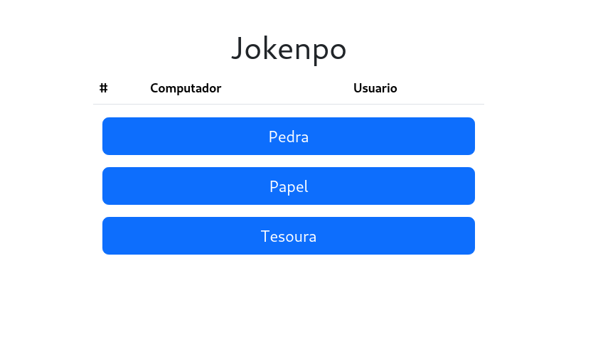
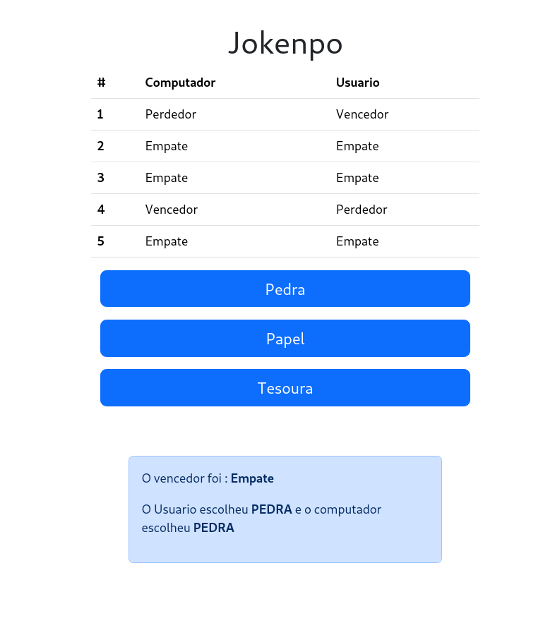

# Jokenpo
Um jogo simles de jokenpo contra um algoritmo aleatorio

## Tecnologias 
- HTML
- CSS
- JAVASCRIPT

## Screenshots





## Como rodar o projeto

#### Clone o repositorio e entre
```bash
    git clone https://github.com/LacamJC/jokenpo.git
    cd jokenpo
```

### Abra no nagegador o arquivo index.html para acessar o contéudo !